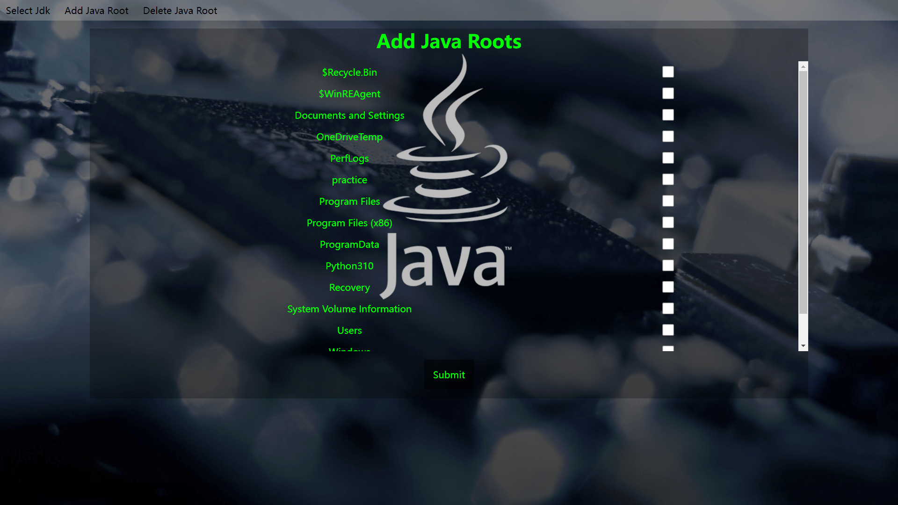

# This program could help you select your jdk on your computer easily
## Prepared
Before you use this program, you need python3 python bottle and a nginx server.

You need to set a url in nginx.conf and locate it to the directory "web/". Then, program will listen to the "http://127.0.0.1:8080/", you must locate it to url "/api/".
## Use
In conf/search_root.py, you can edit it before you use this program, actually, the system will edit it automatically if you don't edit it.

Run your nginx server, and start main.py

The program looks like this.

